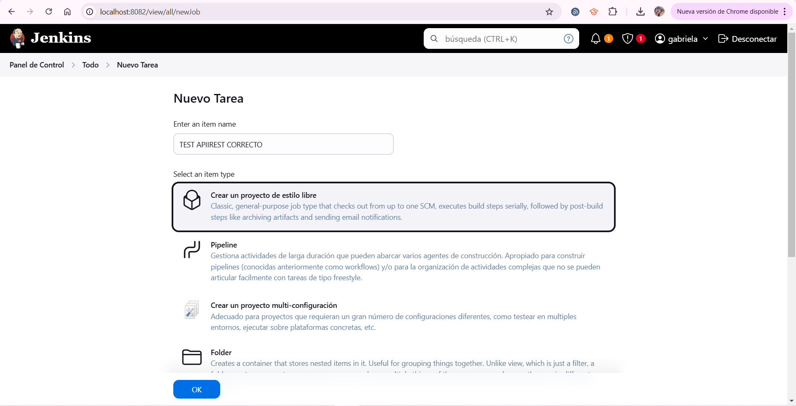
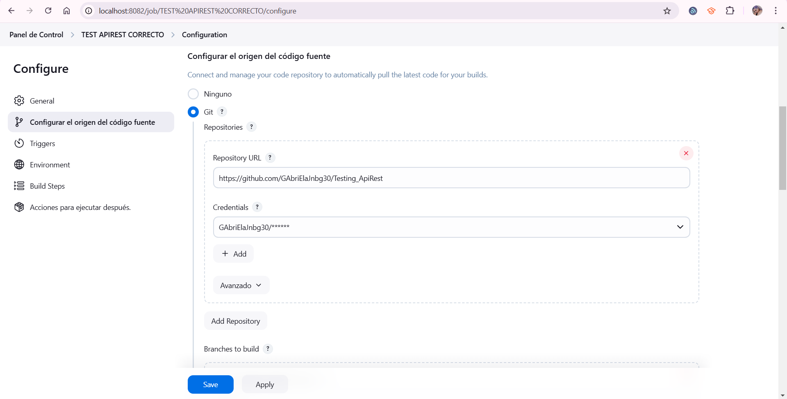
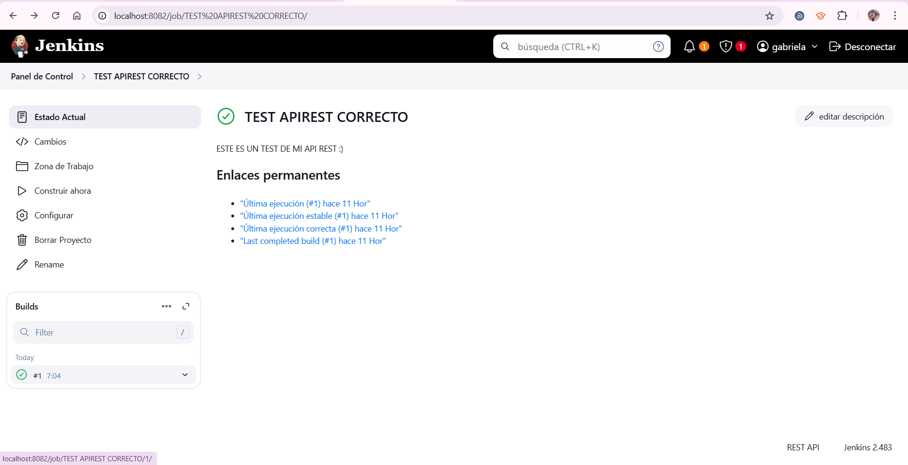
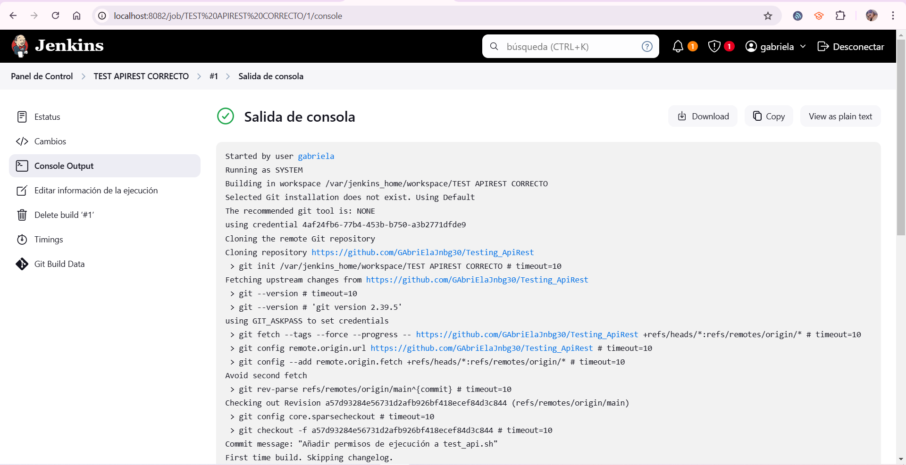
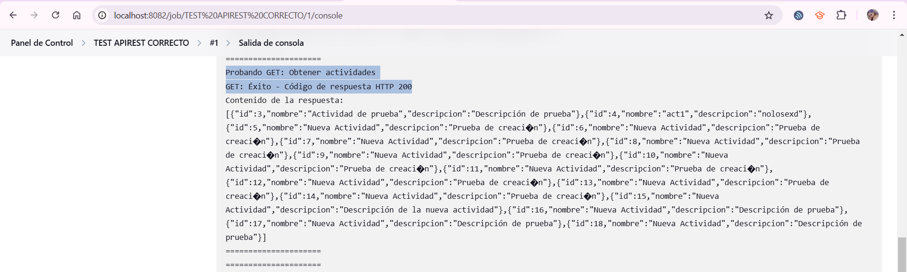

TESTING APIREST
=======
# Testing_ApiRest
Realiza una prueba de tu API REST utilizando jenkins.
Mostrar el codigo para las pruebas.
Poner capturas de pantalla en tu repositorio.
Utiliza un archivo README para mostrar las capturas.
========================================================================================
Ok, estamos utilizando Jenkins
Ahora bien, vamos a ponerle un titulo a la tarea y elegir un item type, en mi caso elegiré free style:

Aquí añado una descripción sobre la acción que haré:

Dado a que tengo un código para el TEST de mi API:
 
NOTA* EL CÓDIGO FUENTE DE MI PROGRAMA SE ENCUENRTA AQUÍ EN EL REPOSITORIO CON EL NOMBRE DE:
"test_api.sh"

Configuramos el origen del código fuente, en este caso el de mi proyecto en git:

Aqu especificamos donde esta el repositorio, en mi caso en el main:

Creando un nuevo paso...

NOTA* Aqui hacemos la llamada con el nombre del archivo: "./test_api.sh", el cual si se encontrará en el
origen del código fuente (github) que le brindamos en un paso anterior

=================================================================================================================
*********************************************** CODIGO DE PRUEBA **************                                     
=================================================================================================================
Mi código se encuentra aquí en el archivo "test_api.sh", pero del mismo modo lo pongo por aquí:

#!/bin/bash

# URL de la API
URL="http://api-go:8080/actividades"

# Token de autenticación
TOKEN="4af24fb6-77b4-453b-b750-a3b2771dfde9"

# Método GET
echo "====================="
echo "Probando GET: Obtener actividades"
response=$(curl -s -w "%{http_code}" -o response.json -H "Authorization: Bearer $TOKEN" "$URL")
http_code=$(tail -n1 <<< "$response")  # Extraer código HTTP
if [ "$http_code" -eq 200 ]; then
    echo "GET: Éxito - Código de respuesta HTTP $http_code"
    echo "Contenido de la respuesta:"
    cat response.json
else
    echo "GET: Error - Código de respuesta HTTP $http_code"
fi
echo "====================="

# Método POST
echo "====================="
echo "Probando POST: Crear nueva actividad"
response=$(curl -s -w "%{http_code}" -o /dev/null -X POST -H "Authorization: Bearer $TOKEN" -d '{"nombre":"Nueva Actividad", "descripcion":"Descripción de prueba"}' "$URL")
if [ "$response" -eq 201 ]; then
    echo "POST: Éxito - Código de respuesta HTTP $response"
else
    echo "POST: Error - Código de respuesta HTTP $response"
fi
echo "====================="

# Método PUT
echo "====================="
echo "Probando PUT: Actualizar actividad con ID 2"
response=$(curl -s -w "%{http_code}" -o /dev/null -X PUT -H "Authorization: Bearer $TOKEN" -d '{"nombre":"Actividad Actualizada", "descripcion":"Descripción actualizada"}' "$URL/2")
if [ "$response" -eq 200 ]; then
    echo "PUT: Éxito - Código de respuesta HTTP $response"
else
    echo "PUT: Error - Código de respuesta HTTP $response"
fi
echo "====================="

# Método DELETE
echo "====================="
echo "Probando DELETE: Eliminar actividad con ID 2"
response=$(curl -s -w "%{http_code}" -o /dev/null -X DELETE -H "Authorization: Bearer $TOKEN" "$URL/2")
if [ "$response" -eq 204 ]; then
    echo "DELETE: Éxito - Código de respuesta HTTP $response"
else
    echo "DELETE: Error - Código de respuesta HTTP $response"
fi
echo "====================="

============================================================================================================
Contruimos el trabajo ahora:

Status de la construcción:

Salida de la consola correcta pt.1:

Salida de la consola correcta pt.2:

Salida de la consola correcta pt.3:

NOTA* Como podemos ver las pruebas se ejecutaron con éxito, en el método GET obtiene respuesta de la API con los
datos que se tienen registrados, los demás métodos funcionan correctamente, ya que al ejecutar, el método POST crea
nuevas actividades y me creó varias actividades de prueba debido a que ejecute varias veces la prueba, el método
PUT actualizó la actividad con el ID 2 de manerana correcta que ya no se ve porque el método DELETE lo eliminó, así
mismo nos hace mención el código de prueba que las 4 pruebas de los métodos se realizaron con éxito:

MÉTODO GET:

MÉTODO POST:

MÉTODO PUT:

MÉTODO DELETE:

FINALIZACIÓN EXITOSA DE LA PRUEBA:

Captura de mi aplicación funcionando antes de la ejecución de las pruebas:

Captura de mi aplicación funcionando después de la ejecución de las pruebas:

Mi docker:
