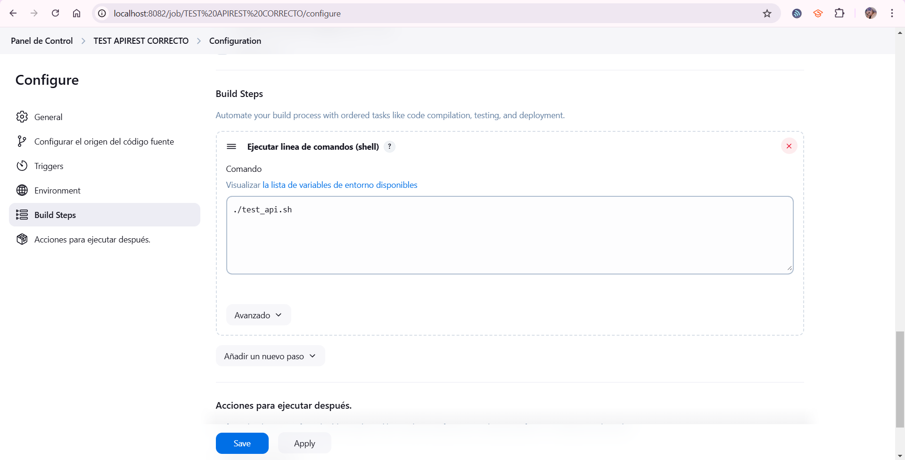
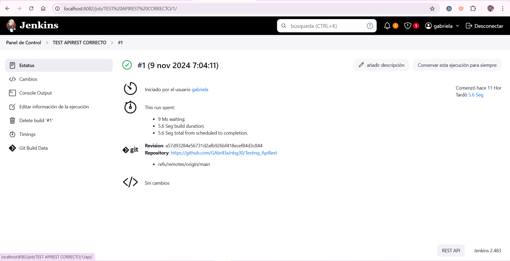

TESTING APIREST
=======
# Testing_ApiRest
Realiza una prueba de tu API REST utilizando jenkins.
Mostrar el codigo para las pruebas
Poner capturas de pantalla en tu repositorio
Utiliza un archivo README para mostrar las capturas
========================================================================================
Ok, estamos utilizando Jenkins

Ahora bien, vamos a ponerle un titulo a la tarea y elegir un item type, en mi caso free style:

Aquí añado una descripción sobre la acción que haré:

Configuramos el origen del código fuente, en este caso el de mi proyecto en git:

Aqu especificamos donde esta el repositorio, en mi caso en el main 

Creando un nuevo paso...

código de mi prueba:
#!/bin/bash

API_URL="http://localhost:8080/actividades"

# Prueba de Obtener Actividades
echo "Prueba de Obtener Actividades"
RESPONSE_GET=$(curl -s -o /dev/null -w "%{http_code}" $API_URL)
echo "Código de respuesta GET: $RESPONSE_GET"

# Prueba de Crear Actividad
echo "Prueba de Crear Actividad"
NEW_ACTIVITY='{"nombre":"Actividad de Prueba","descripcion":"Descripción de la actividad de prueba"}'
RESPONSE_POST=$(curl -s -o /dev/null -w "%{http_code}" -X POST -H "Content-Type: application/json" -d "$NEW_ACTIVITY" $API_URL)
echo "Código de respuesta POST: $RESPONSE_POST"

# Prueba de Actualizar Actividad
echo "Prueba de Actualizar Actividad"
ACTIVITY_ID=1  # Cambia esto según el ID de la actividad que creaste
UPDATED_ACTIVITY='{"nombre":"Actividad Actualizada","descripcion":"Descripción actualizada"}'
RESPONSE_PUT=$(curl -s -o /dev/null -w "%{http_code}" -X PUT -H "Content-Type: application/json" -d "$UPDATED_ACTIVITY" $API_URL/$ACTIVITY_ID)
echo "Código de respuesta PUT: $RESPONSE_PUT"

# Prueba de Eliminar Actividad
echo "Prueba de Eliminar Actividad"
RESPONSE_DELETE=$(curl -s -o /dev/null -w "%{http_code}" -X DELETE $API_URL/$ACTIVITY_ID)
echo "Código de respuesta DELETE: $RESPONSE_DELETE"

Contruimos el trabajo ahora:

Status: correcto

Cambios: correcto
