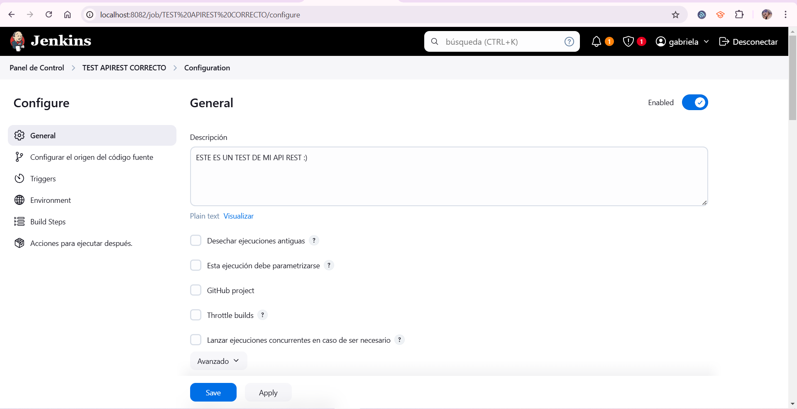
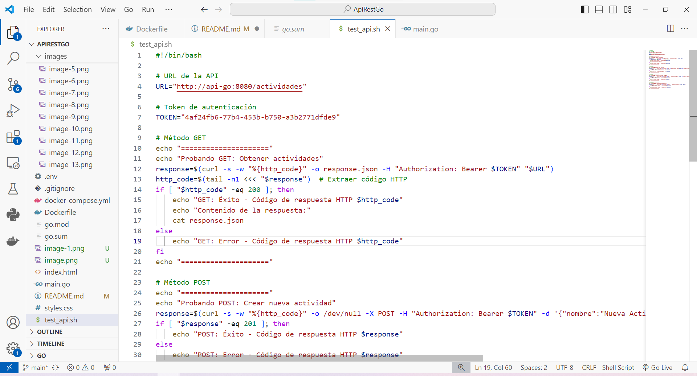
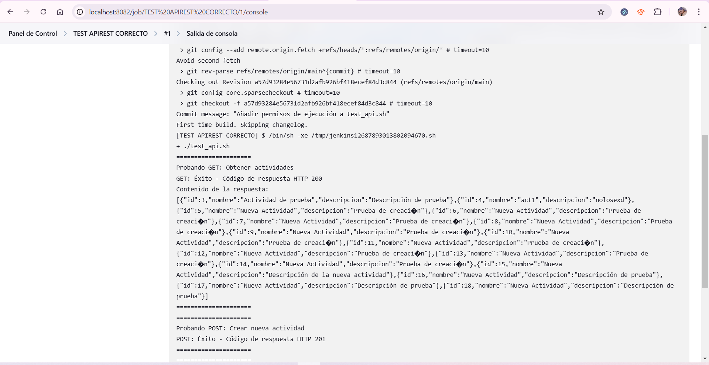
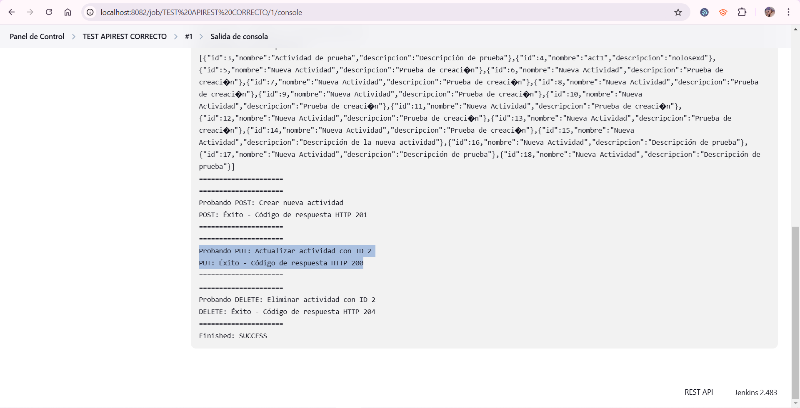

TESTING APIREST
=======
# Testing_ApiRest
Realiza una prueba de tu API REST utilizando jenkins.
Mostrar el codigo para las pruebas
Poner capturas de pantalla en tu repositorio
Utiliza un archivo README para mostrar las capturas
<<<<<<< HEAD
========================================================================================
Ok, estamos utilizando Jenkins

Ahora bien, vamos a ponerle un titulo a la tarea y elegir un item type, en mi caso free style:

Aquí añado una descripción sobre la acción que haré:

Configuramos el origen del código fuente, en este caso el de mi proyecto en git:

Aqu especificamos donde esta el repositorio, en mi caso en el main 

Creando un nuevo paso...

=========================================================================================================================
*********************************************** CODIGO DE PRUEBA ******************************************                                        
=========================================================================================================================
código de mi prueba:
#!/bin/bash

# Definir las credenciales
USER="root"
PASSWORD="gn300803"
API_URL="http://localhost:8080" # Cambia esto si es necesario

# Prueba GET: Obtener todas las actividades
echo "Prueba GET: Obtener todas las actividades"
GET_RESPONSE=$(curl -u "$USER:$PASSWORD" -X GET "$API_URL/actividades")
echo "$GET_RESPONSE"
if [ $? -eq 0 ]; then
    echo "GET: correcto"
else
    echo "GET: error"
fi

# Prueba POST: Crear una nueva actividad
echo "Prueba POST: Crear una nueva actividad"
NEW_ACTIVITY='{"nombre": "Actividad de prueba", "descripcion": "Descripción de prueba"}'
POST_RESPONSE=$(curl -u "$USER:$PASSWORD" -X POST "$API_URL/actividades" -H "Content-Type: application/json" -d "$NEW_ACTIVITY")
echo "$POST_RESPONSE"
if [ $? -eq 0 ]; then
    echo "POST: correcto"
else
    echo "POST: error"
fi

# Prueba PUT: Actualizar la actividad con ID 1
echo "Prueba PUT: Actualizar la actividad con ID 1"
UPDATE_ACTIVITY='{"nombre": "Actividad actualizada", "descripcion": "Descripción actualizada"}'
PUT_RESPONSE=$(curl -u "$USER:$PASSWORD" -X PUT "$API_URL/actividades/1" -H "Content-Type: application/json" -d "$UPDATE_ACTIVITY")
echo "$PUT_RESPONSE"
if [ $? -eq 0 ]; then
    echo "PUT: correcto"
else
    echo "PUT: error"
fi

# Prueba DELETE: Eliminar la actividad con ID 1
echo "Prueba DELETE: Eliminar la actividad con ID 1"
DELETE_RESPONSE=$(curl -u "$USER:$PASSWORD" -X DELETE "$API_URL/actividades/1")
echo "$DELETE_RESPONSE"
if [ $? -eq 0 ]; then
    echo "DELETE: correcto"
else
    echo "DELETE: error"
fi

echo "Pruebas completadas."

========================================================================================
Contruimos el trabajo ahora, status correcto:

Salida de la consola, correcta:

Funciones probadas, solo algunas requieren autorizacion por seguridad, pero todo bien:

Una de mi aplicaion funcionando:

Mi docker:
